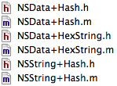

CocoaHash
=========

Categories for NSData and NSString for the hashing algorithms supported by CommonCrypto.

Hashing algorithms supported:
 * MD2
 * MD4
 * MD5
 * SHA1
 * SHA224
 * SHA256
 * SHA384
 * SHA512

How to Use
=========

Include the .h and .m files in ```CocoaHash``` in your project.



Example use:

```
#import "NSString+Hash.h"
...
NSString *filePath = @"/Users/Wookie/myfile.txt";
NSString *filePathHashStr = [filePath stringByHashingWithSHA256UsingEncoding:NSUTF8StringEncoding];
NSData *filePathHash = [filePath dataByHashingWithSHA256UsingEncoding:NSUTF8StringEncoding];
```

In the example, ```filePathHash``` will be ```@"408244fa01ebb60b5d2f73a9a5ba11404c7235e5691f5ea45efcfd5e310797c3"```.

The same functions are available on ```NSData``` as a category, without the encoding parameter.

License
=========

Copyright (c) 2013, Leigh McCulloch All rights reserved.

BSD-2-Clause License: http://opensource.org/licenses/BSD-2-Clause

Redistribution and use in source and binary forms, with or without modification, are permitted provided that the following conditions are met:

Redistributions of source code must retain the above copyright notice, this list of conditions and the following disclaimer.

Redistributions in binary form must reproduce the above copyright notice, this list of conditions and the following disclaimer in the documentation and/or other materials provided with the distribution.

THIS SOFTWARE IS PROVIDED BY THE COPYRIGHT HOLDERS AND CONTRIBUTORS "AS IS" AND ANY EXPRESS OR IMPLIED WARRANTIES, INCLUDING, BUT NOT LIMITED TO, THE IMPLIED WARRANTIES OF MERCHANTABILITY AND FITNESS FOR A PARTICULAR PURPOSE ARE DISCLAIMED. IN NO EVENT SHALL THE COPYRIGHT HOLDER OR CONTRIBUTORS BE LIABLE FOR ANY DIRECT, INDIRECT, INCIDENTAL, SPECIAL, EXEMPLARY, OR CONSEQUENTIAL DAMAGES (INCLUDING, BUT NOT LIMITED TO, PROCUREMENT OF SUBSTITUTE GOODS OR SERVICES; LOSS OF USE, DATA, OR PROFITS; OR BUSINESS INTERRUPTION) HOWEVER CAUSED AND ON ANY THEORY OF LIABILITY, WHETHER IN CONTRACT, STRICT LIABILITY, OR TORT (INCLUDING NEGLIGENCE OR OTHERWISE) ARISING IN ANY WAY OUT OF THE USE OF THIS SOFTWARE, EVEN IF ADVISED OF THE POSSIBILITY OF SUCH DAMAGE.
